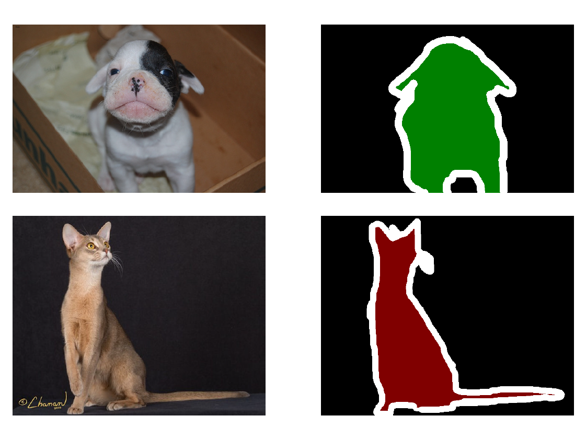
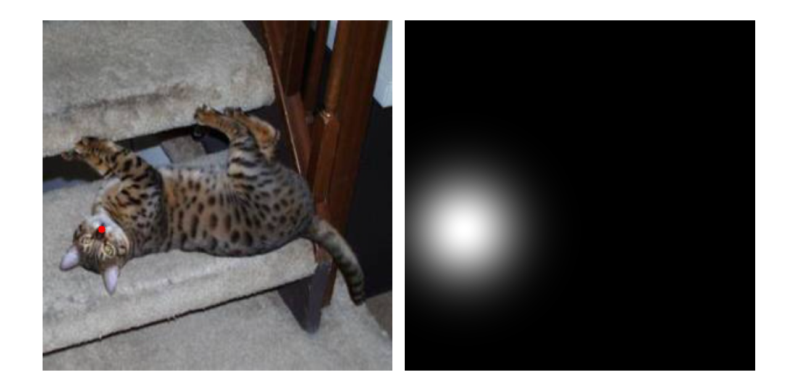
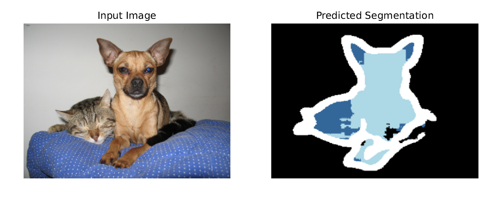

# Computer Vision Project
## Image segmentation in pets classes

The aim of the present [project](Report.pdf) is to experiment disparate image segmentation techniques on a properly [pre-processed and augmented](data_preprocessing.py) images dataset (i.e., a version of the [Oxford-IIIT Pet Dataset](https://www.robots.ox.ac.uk/~vgg/data/pets/)), exploring both traditional and modern DL approaches to this task. Specifically, the importance of pre-training and feature-extraction strategies is investigated, comparing the performance of a [UNet-based end-to-end NN](Unet.py) to the one of [Autoencoder-based](AutoEncoder.py) and [CLIP-bolstered](Clip.py) architectures. The latter well-performing model is also experimented in a [prompt-based version](PromptedClip.py), enriching the input format through a systematic [annotation](annotation.py) of the images with an informative rationale. Evaluating their test [performance](performance_evaluation.py) and [robustness](robustness_exploration.py) to input perturbations, these methods’ outcomes are then comparatively discussed.

> [!NOTE]  
> The best-performing model was integrated into an interactive User Interface (UI), enabling direct user interaction via multiple forms of input; the relevant branch contains code and info.

### Example images

#### Data and target

#### Noses annotation and heatmap

#### UNet output

