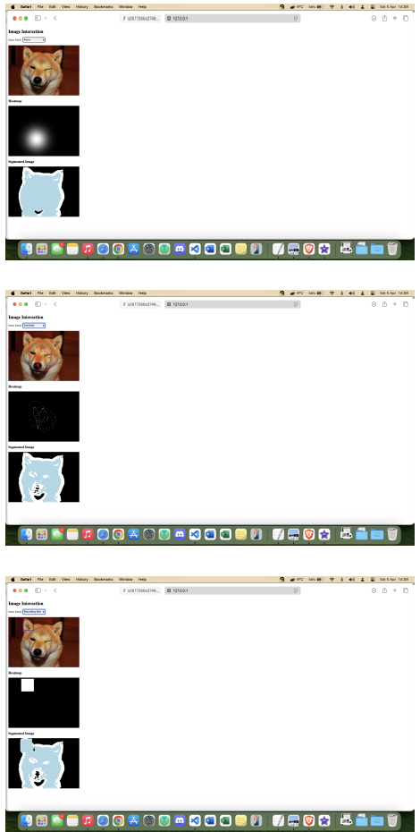

# Computer Vision Project
## Image segmentation in pets classes
### User Interface

The best-performing model was integrated into an interactive User Interface (UI), enabling direct user interaction and multiple forms of input.
Users are prompted to upload an image and select a point of interest by clicking on it. This interaction generates a heatmap, which is then processed by the prompt-based CLIP model described earlier. The segmentation result is subsequently displayed, allowing users to refine the segmentation process by providing explicit input.
Moreover, additional functionality was implemented to support multiple forms of prompts, including scribbling and bounding box inputs. Users can either draw directly on the uploaded image to guide the model toward specific shapes or define a bounding box around the region of interest. These features provide enhanced flexibility, enabling users to influence the segmentation
outcome based on their intended focus. By integrating point-based selection, freehand annotations, and bounding box inputs, the interface offers an intuitive and interactive experience, significantly improving the model’s segmentation capabilities.

#### UI screenshots: point- scribble- and box-based examples

